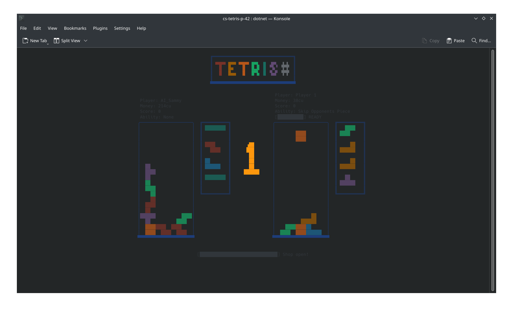

## TETRIS in C#
Made for the Object Oriented Programming 1 course at Uppsala University.

### Running
Prerequisites:
- .NET 9 SDK
- A terminal that supports ANSI escape codes (most do) and even if not, it will just look bad.

```bash
# In the root directory of the project
dotnet run --project Tetris
```

### Screenshots
<div align="center">
    
    
</div>
<div align="center">
    
    
</div>